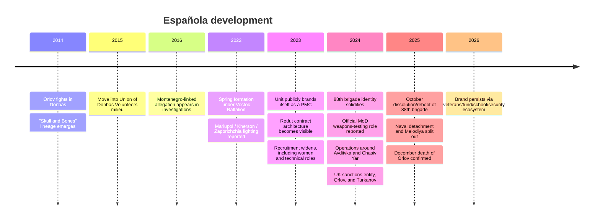
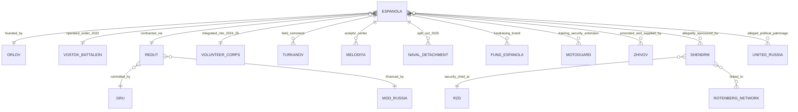

# Española

## Executive Summary

Open sources support a clear analytical conclusion: Española was **not** a conventional, legally independent private military company in the way the label suggests. It is better understood as a **far-right, football-ultra-based Russian paramilitary brand and combat formation** that grew out of a 2014 Donbas lineage around **entity["people","Stanislav Orlov","espanola commander"]**, re-emerged as a spring 2022 volunteer detachment under **entity["organization","Vostok Battalion","dpr armed unit"]**, publicly adopted PMC branding in 2023, recruited and contracted through **entity["organization","Redut","russian pmc"]**, and by late 2024 was operating as the **88th volunteer brigade** within the Russian **entity["organization","Volunteer Corps","russian mod corps"]** / “South” grouping architecture. By October 2025, that brigade was officially dissolved or “rebooted,” but as of early 2026 the wider Española brand still appears active through a veterans/fund/school/security ecosystem and official social channels. citeturn46view0turn32view0turn31search3turn29view0turn32view2turn33search1turn33search0turn42search4

The highest-confidence human and institutional nodes are Orlov as founder-commander; **entity["people","Mikhail Turkanov","espanola commander"]** as a prominent field commander and propaganda face; Redut as the contract umbrella; the **entity["organization","GRU","russian military intelligence"]** and the **entity["organization","Ministry of Defence of the Russian Federation","russian defense ministry"]** as the state structures most consistently linked to the system; and a secondary support network involving **entity["people","Viktor Shendrik","rzd security chief"]**, **entity["company","Russian Railways","state rail company"]**, **entity["people","Arkady Rotenberg","russian businessman"]**, **entity["people","Boris Rotenberg","russian businessman"]**, and propagandist-logistics figures such as **entity["people","Alexey Zhivov","pro-war blogger"]**. The clearest formal legal measures located in open sources are the U.K.’s 7 November 2024 sanctions against “PMC Espanola,” Orlov, and Turkanov; Redut separately appears in U.S., EU, and U.K. sanctions. citeturn39view0turn38view0turn20view2turn20view0turn45view1turn17search0

The main unresolved questions are not trivial footnotes but central analytical uncertainties: whether the unit should be “dated” to 2014 or only to 2022; how much of its financing came from the Russian state, how much from oligarchic or para-state patrons, and how much from crowdfunding; whether **entity["organization","United Russia","russian political party"]** genuinely “controlled” the formation or merely intersected with its recruitment/patronage; what its real manpower was at peak; and what exactly happened in Orlov’s December 2025 death in **entity["city","Sevastopol","crimea, ukraine"]**. On those issues, the evidence is mixed, and confidence varies sharply by claim. citeturn21view0turn45view1turn40search2turn40search6turn41search3turn29view3

## Identity and naming

The most useful way to classify Española is as a **hybrid formation**: part volunteer combat detachment, part far-right hooligan militia, part state-linked mercenary/recruitment mechanism, and—especially after 2024—part military-technical and propaganda brand. Official and semi-official Russian material often frames it as a volunteer brigade; the unit itself at times used PMC language; Western sanctions authorities treated it as a PMC; and RFE/RL’s documentary work on Redut strongly suggests that, in practice, the supposedly “private” layer served as a legal/administrative buffer for state-controlled warfighting. citeturn32view0turn29view0turn39view0turn46view0

### Name variants

| Variant | Usage in the reviewed corpus | Assessment |
|---|---|---|
| **Эспаньола** | Dominant Russian self-description on the official Telegram channel and in Russian state-media coverage. citeturn33search1turn29view0 | **Primary official/self-used form** |
| **Espanola / PMC Espanola** | Used in U.K. sanctions notices for the entity and for Orlov’s position. citeturn3view1turn39view0 | **Primary official Anglo/ASCII form** |
| **Española** | Common in English- and Spanish-language analytical and press coverage. citeturn8view0turn14search11turn41search3 | **Standard transliterated journalistic form** |
| **88th Brigade / 88th Volunteer Brigade / 88th Reconnaissance-Sabotage Brigade** | Used in 2024–2025 Russian reporting and the unit’s own post-2024 messaging. citeturn31search1turn31search3turn29view0turn24search3 | **Operational/organizational label during later phase** |
| **Hispaniola** | Appears mainly in secondary transliterations and reference-style material, not as the dominant official spelling in the primary corpus reviewed here. citeturn30search11turn14search0 | **Secondary transliteration; lower evidentiary weight** |

The exact spelling **“Hispanola”** did **not** surface in the official or primary materials reviewed for this report. The nearest recurring secondary variant is **“Hispaniola.”**

## Narrative history and verified timeline

The earliest traceable **lineage** runs back to 2014, but the earliest traceable **formation under the Española name as a distinct wartime unit** runs to spring 2022. Open-source reporting consistently places Orlov—a Moscow-born CSKA ultra later described in Russian media as a veteran of the 106th Airborne Division and the Second Chechen War—in the Donbas war from 2014 onward. Multiple sources say that in or around **entity["city","Horlivka","donetsk oblast, ukraine"]**, he built a reconnaissance detachment called **“Skull and Bones”**, which later fought around **entity["city","Debaltseve","donetsk oblast, ukraine"]**. That is the strongest evidentiary basis for a 2014 lineage claim. It is **not** the same thing as proving that the entity later sanctioned as “PMC Espanola” already existed in 2014 under that exact structure. citeturn8view0turn25search2turn26search2turn41search0

After the first Donbas phase, Orlov is reported to have moved into the **entity["organization","Union of Donbas Volunteers","russian volunteer union"]**, a semi-official Russian veterans/recruitment network. Open-source investigators also linked him to the milieu around the 2016 attempted coup in **entity["country","Montenegro","balkans"]**, but that part of the record is materially weaker: it rests on investigative reconstruction rather than official court findings tying him personally to a convicted conspiracy. This is best treated as an allegation that broadens the pre-2022 network picture rather than a fully settled fact about criminal participation. citeturn26search0turn26search1turn26search2turn41search0

The clearest evidence for the formation’s **actual wartime emergence as Española** points to **spring 2022**. Independent and state-linked sources agree that Orlov gathered football ultras and veterans into a volunteer detachment under the Vostok battalion in occupied eastern Ukraine during the early phase of the full-scale invasion. Combat participation is reported for the siege of **entity["city","Mariupol","donetsk oblast, ukraine"]**, then later on the **entity["city","Kherson","kherson oblast, ukraine"]** and **entity["city","Zaporizhzhia","zaporizhzhia oblast, ukraine"]** directions, around **entity["city","Vuhledar","donetsk oblast, ukraine"]**, and later on the **entity["city","Bakhmut","donetsk oblast, ukraine"]** axis. The unit’s human base was described as ultras from clubs including **entity["sports_team","CSKA Moscow","moscow club"]**, **entity["sports_team","Zenit Saint Petersburg","st petersburg club"]**, **entity["sports_team","Spartak Moscow","moscow club"]**, and **entity["sports_team","Lokomotiv Moscow","moscow club"]**. citeturn8view0turn7view3turn45view1turn14search11

In **February 2023**, the unit publicly adopted the language of a PMC. That mattered less as a legal fact—Russia has no formal legal category for PMCs in the ordinary sense—than as a branding and contracting step. By late 2023, RFE/RL’s reporting on Redut had exposed the broader mechanism by which multiple “private” and “volunteer” formations signed opaque contracts through ghost or front-like entities connected to a GRU-run force-generation network. For Española, the best-supported reading is that it **used PMC branding but functioned inside a Redut/GRU/MoD ecosystem**, rather than outside it. Recruitment reporting from 2023–2024 also shows expansion beyond male football ultras into technical specialists, drone operators, snipers, and even women for assault roles—an unusual step among Russian formations. citeturn45view1turn46view0turn22search5turn22search4turn21view0

By 2024, the state linkage had become more visible rather than less. Russian state media described the formation as the **88th brigade**, tied it to the Volunteer Corps and the “South” grouping, reported its role in the fighting around **entity["city","Avdiivka","donetsk oblast, ukraine"]** and then **entity["city","Chasiv Yar","donetsk oblast, ukraine"]**, and quoted Orlov saying the brigade had become an official Russian MoD testing ground for new weapons. In parallel, the U.K. formally sanctioned the **entity “PMC Espanola”** and separately designated Orlov and Turkanov on 7 November 2024. That combination—state-media integration plus formal foreign sanctions against the group as a PMC—captures the central ambiguity of the formation: semi-official in practice, “private” in label, and state-useful in function. citeturn32view0turn29view1turn31search1turn31search3turn3view1turn39view0turn38view0

The next decisive break came in **October 2025**. Española announced that the 88th brigade, “in the form and composition” in which it had entered the **Klishchiivka–Chasiv Yar** phase of the war, would cease to exist and undergo a “full reboot.” Russian reporting and the unit’s own channel indicated that the naval detachment would continue separately, the **Melodiya** analytical-reconnaissance center had already been spun out, and new EW and assault structures would be built from the remains. Yet on the same day, a senior corps political officer publicly insisted the brigade was still carrying out tasks inside the Volunteer Corps. The most defensible reading is that a real organizational split occurred, but under conditions of Russian wartime opacity and deliberate ambiguity. citeturn29view0turn32view2turn24search3turn24search6

In **December 2025**, Orlov’s death ended the group’s founding cycle. The official channel confirmed his death on 19 December but said investigators were still establishing the exact cause and place. Other reporting—Russian opposition outlets, Jamestown’s later synthesis, and Spanish reporting in **El País**—described a fatal shooting in Sevastopol during or around an attempted detention tied to arms-trafficking suspicions. That latter version is plausible and widely repeated, but it remains **not fully verified** in open official records. What is verifiable is that the old 88th brigade had already been dissolved/reformatted, and that by early 2026 the **Española brand** persisted through a veterans union, a charity fund, civilian-military schools in **entity["city","Moscow","russia"]**, and “MotoGuard” security-style structures, even though the former brigade no longer existed in its previous form. citeturn40search2turn40search6turn29view3turn41search3turn33search1turn33search0turn42search4

### Verified timeline table

| Date | Event | Location | Confidence | Sources |
|---|---|---|---|---|
| 2014 | Orlov enters the Donbas war; reporting places him in/around Horlivka and ties him to the “Skull and Bones” reconnaissance lineage that later feeds Española. | Horlivka / Debaltseve, Ukraine | **Medium-high** for Orlov’s 2014 role; **medium** for direct continuity to later Española | citeturn8view0turn26search2turn25search2 |
| 2015 | Orlov is reported to have shifted from frontline fighting into the Union of Donbas Volunteers network. | Russia / occupied Donbas | **Medium** | citeturn41search0turn26search2 |
| 2016 | Investigators allege Orlov’s presence in the Montenegro coup milieu; not established here by a court record against him personally. | Montenegro | **Low-medium** | citeturn26search0turn26search1 |
| Spring 2022 | Española forms as a volunteer detachment under Vostok, built from football ultras and Donbas veterans. | Occupied eastern Ukraine | **High** | citeturn8view0turn45view1turn14search11 |
| 2022 | Reported combat participation in Mariupol and then on Kherson / Zaporizhzhia directions. | Mariupol, Kherson, Zaporizhzhia | **Medium-high** for participation; **lower** for combat-effect claims | citeturn7view3turn45view1 |
| Feb 2023 | The unit publicly claims PMC status. | Online / Russia-occupied Ukraine | **High** for the branding change | citeturn45view1turn8view0 |
| Late 2023 | Recruitment widens to women, drone roles, and other specialties; Redut contract architecture becomes clearer. | Russia / occupied territories | **Medium-high** | citeturn22search5turn22search4turn46view0 |
| Mar 2024 | iStories alleges Viktor Shendrik, linked to Russian Railways and the Rotenberg network, sponsors and manages the formation. | Russia | **Medium** | citeturn45view1 |
| Aug–Nov 2024 | Russian state media describes Española as the 88th brigade, officially testing new MoD weapons and fighting around Avdiivka / Chasiv Yar; U.K. sanctions entity and key figures in Nov. | Chasiv Yar axis / Russia | **High** for designation and framework; **medium-high** for operations | citeturn32view0turn29view1turn31search1turn39view0turn38view0 |
| Oct 2025 | 88th brigade announces dissolution/reboot; naval detachment and Melodiya split out; Russian corps official simultaneously says it still performs tasks within the corps. | Russia / occupied Ukraine | **High** that reorganization occurred; **medium** on exact legal outcome | citeturn29view0turn32view2turn24search3turn24search6 |
| Dec 2025 | Orlov’s death is confirmed; cause remains disputed in open sources. | Sevastopol / Crimea | **High** for death; **low-medium** for exact circumstances | citeturn40search2turn40search6turn29view3turn41search3 |
| Early 2026 | The old brigade is gone, but the wider brand persists through the veterans union, fund, Telegram/VK channels, and MotoGuard/civilian training activities. | Moscow and online | **High** for persistence of the brand ecosystem | citeturn33search1turn33search0turn42search4turn33search13 |

The mermaid chart below compresses the higher-confidence sequence above into a single operational timeline. citeturn8view0turn45view1turn46view0turn32view0turn29view0turn40search2turn33search1

## Actors and organizational architecture

The structure that emerges from the record is hierarchical, but only partly transparent. At the command level, Orlov gave the formation its identity, symbolism, and public narrative. At the contracting and force-generation level, the formation sat inside the Redut system, which RFE/RL documented as a GRU-run recruitment shell using opaque legal vehicles and nonstandard contracts. At the integration level, the unit increasingly appears folded into the Russian MoD / Volunteer Corps architecture by 2024–2025. And around those layers sat a support ecosystem of sponsors, propagandists, sports-world contacts, a charity fund, and post-2025 civilian/security extensions. citeturn46view0turn32view0turn32view2turn45view1turn17search0

### Main individual actors

| Actor | Role and biography | Aliases | Affiliations | Sanctions / legal actions found in reviewed sources | Geospatial reach | Sources |
|---|---|---|---|---|---|---|
| **entity["people","Stanislav Orlov","espanola commander"]** | Founder and long-time commander. Russian media later described him as Moscow-born, a CSKA Red-Blue Warriors member, an MGTU graduate, and a veteran of the 106th Airborne Division / Second Chechen War; those biographical details are not independently documented here through official service records. He is the principal bridge between the 2014 Donbas “Skull and Bones” lineage and the 2022–2025 Española formation. | “Spaniard” / `Испанец` | Skull and Bones lineage; Vostok; later Redut / Volunteer Corps; UDV milieu | U.K. designated 7 Nov 2024 as “Commander, PMC Espanola.” Death confirmed Dec 2025; allegation of arms-trafficking-linked detention remains unproven in reviewed official records. | Moscow; Donbas; Crimea / Sevastopol | citeturn39view0turn8view0turn25search2turn41search0turn40search2 |
| **entity["people","Mikhail Turkanov","espanola commander"]** | Prominent commander and online face. Former MMA fighter, linked to Zenit’s hooligan scene, later presented as a commander of anti-air / assault elements. His visibility made him central to propaganda and recruitment. | “The Pitbull” / `Питбуль` | Zenit ultra milieu; Española command element | U.K. designated 7 Nov 2024. Russian press and Cherta report a 2019 fine for public display of Nazi symbols; Cherta also reports prior imprisonment for extortion. | St. Petersburg; Donbas combat zone | citeturn38view0turn45view0turn44search0turn8view0 |
| **entity["people","Viktor Shendrik","rzd security chief"]** | Alleged sponsor/manager per iStories. Former Vympel officer; later head of security at Russian Railways; described as a Rotenberg protégé. This is one of the strongest open-source leads on elite patronage, but it remains investigative rather than officially documented. | — | Russian Railways; Rotenberg network | No sanctions or prosecutions surfaced in the reviewed corpus specifically tied to Española. | Moscow / Russian corporate-security nexus | citeturn45view1 |
| **entity["people","Alexey Zhivov","pro-war blogger"]** | Propagandist-volunteer and fundraiser repeatedly identified by Ukrainian sanctions-tracking material as a promoter and material supporter of Española, including UAV and EW fundraising. | `Живов Z` | Pro-war media ecosystem; Española logistical support; charity connections | Listed on the GUR War & Sanctions portal, which also notes sanctions in multiple partner jurisdictions. | Moscow; occupied territories; online | citeturn17search0 |
| **entity["athlete","Andrey Solomatin","russian footballer"]** | Former Russian national-team footballer used as a public prestige recruit/endorser. His accession was publicized in 2023 and symbolically reinforced the unit’s football identity. | “Soloma” | Former CSKA and Lokomotiv player; Española volunteer | No sanctions or legal actions surfaced in the reviewed corpus tied to Española. | Public-facing, especially Bakhmut-area messaging | citeturn8view0turn14search9 |
| **entity["people","Alexey Trifonov","espanola supporter"]** and **entity["people","Ilya Khanin","espanola supplier"]** | Civilian-support / humanitarian wing figures in a Readovka documentary cited by Cherta. Khanin is linked by Cherta to business and charitable structures and to political-family relationships around United Russia figures. | — | Humanitarian wing; local patronage networks | No sanctions or court actions surfaced in the reviewed corpus. | Moscow region; Horlivka-related reconstruction links | citeturn45view0 |

### Main organizational actors

| Actor | Function in the network | Notes | Sources |
|---|---|---|---|
| **entity["organization","Redut","russian pmc"]** | Contract umbrella / mercenary-recruitment shell | RFE/RL’s strongest finding is that Redut was not a normal private company but a GRU-run front using opaque contracts, ghost entities, and legal distance from the state. U.K., U.S., and EU measures exist against Redut as an entity. | citeturn46view0turn20view2turn20view0turn19search15 |
| **entity["organization","GRU","russian military intelligence"]** | State control / coordination layer | Recruiters quoted by RFE/RL explicitly described Redut as “GRU,” and one contract pointed to a GRU-linked “RLSPI Redut” structure connected to military unit 35555. | citeturn46view0 |
| **entity["organization","Ministry of Defence of the Russian Federation","russian defense ministry"]** | Paymaster, command integration, weapons testing | State-media reporting and recruiter testimony indicate MoD financing/control; TASS later reported that Española became an official testing ground for new MoD weapons. | citeturn46view0turn32view0turn32view1 |
| **entity["organization","Vostok Battalion","dpr armed unit"]** | Early host formation | The earliest 2022 phase of Española was nested under Vostok in occupied Donbas. | citeturn21view0turn45view1 |
| **entity["organization","Volunteer Corps","russian mod corps"]** | Later-force structure | By 2024–2025, Russian reporting repeatedly placed the 88th brigade inside the Volunteer Corps operating within the “South” grouping. | citeturn31search1turn31search3turn32view2 |
| **Melodiya** | Reconnaissance / analytical center | GNET describes it as an OSINT and intelligence hub using open sources, liaison, and “pro-Russian human sources.” In October 2025 the unit’s own channel said it had been spun out into a separate structure. | citeturn8view0turn24search3turn24search13 |
| **Fund “Española”** | Overt fundraising/brand institution | A charity/fund structure appears in 2024 Russian corporate-registry aggregators and in the unit’s 2026 Telegram self-presentation. It looks like an overt support vehicle, not necessarily a covert front. | citeturn35search2turn33search1 |
| **MotoGuard / Legion MotoGuard Española** | Post-2025 security/training extension | The official channel describes it as a group of civil-military security enterprises and a civilian tactical/motor school. This is one of the clearest signs that the brand survived beyond the old brigade. | citeturn42search4turn33search0turn42search1 |
| **entity["organization","United Russia","russian political party"]** | Alleged political patronage / recruitment resource | Ukrainian intelligence publicly claimed United Russia had “acquired” the formation and funded recruitment; Cherta also identified local United Russia-adjacent patronage around support activities. Independent confirmation is incomplete. | citeturn21view0turn45view0 |
| **entity["company","Russian Railways","state rail company"]** | Alleged para-state sponsor through Shendrik | iStories ties support to its security chief Shendrik, not to a formal corporate resolution or open budget line. | citeturn45view1 |

The diagram below summarizes the most defensible structural relationships in the reviewed corpus. Solid links are better documented than dashed or explicitly labeled “alleged” links. citeturn46view0turn32view0turn32view2turn45view1turn42search4turn17search0

## Reach, funding, recruitment, and propaganda

Española’s recruitment model depended on **subculture conversion** rather than simple mass mobilization. Its core message targeted football ultras and adjacent far-right milieus that were culturally distinct from the Kremlin’s formal patriotism but could be drawn in through fraternity, violence, prestige, and eventually payment. Ukrainian intelligence said volunteers were being offered **RUB 220,000 per month**, a minimum **six-month** contract, and injury/death insurance payments; those figures are plausible and consistent with broader Russian volunteer-pay patterns, but they should still be read as adversary-intelligence reporting rather than as audited payroll data. At the same time, the unit itself and later media reporting show that recruitment expanded into drone operators, snipers, EW specialists, mechanics, medics, and women for combat and combat-support roles. Training footprints also point toward a wider support infrastructure, including likely Redut-linked preparation around **entity["city","Tambov","russia"]** and post-2025 civilian courses in Moscow under the MotoGuard brand. citeturn21view0turn8view0turn22search5turn33search0turn33search13

On funding, the evidence supports a **mixed model**. First, RFE/RL’s Redut investigation strongly indicates that the “private” shell was financed and coordinated through the Russian state, especially the MoD/GRU system. Second, there is a public layer of crowdfunding, humanitarian collection, and sponsor-propagandist support, especially through Zhivov and other pro-war influencers. Third, iStories provided the sharpest open-source allegation of elite patronage, arguing that Shendrik—embedded in the Russian Railways / Rotenberg orbit—sponsored and managed the formation after it moved beyond the Vostok phase. Fourth, the registered Fund “Española” and the subsequent MotoGuard security/training structures suggest a formalization of the rear-area brand economy by 2024–2026. What open sources **do not** provide is a bank-record level breakdown of cash flows. citeturn46view0turn17search0turn45view1turn35search2turn42search4

Its propaganda model was unusually effective because it fused three audiences that do not normally merge neatly: war supporters, football subcultures, and tech-military hobbyists. The unit’s official Telegram and VK presence were central; GNET specifically identified Telegram and VK as recruitment, fundraising, and support-building platforms. Russian state and quasi-state media amplified the group, and the sports world supplied symbolic legitimacy. GNET noted a dedicated CSKA hockey night for the formation; the Ukrainian War & Sanctions portal records a **1 September 2023** CSKA support event involving players such as **entity["athlete","Ivan Fedotov","russian ice hockey player"]**. The result was a pipeline that normalized the group not only as a combat formation but as a social movement, memorial culture, and youth-facing patriotic identity. citeturn8view0turn33search1turn17search2

Geographically, the formation’s reach was wider than its formal manpower. Its **combat geography** ran through occupied eastern and southern Ukraine: Mariupol, the Bakhmut area, Avdiivka, and Chasiv Yar, with earlier self-reported presence on Kherson and Zaporizhzhia directions. Its **rear-area geography** ran through Moscow, the Moscow region, and **entity["city","Saint Petersburg","russia"]** via football, business, and propaganda networks. A distinct **Crimea** layer emerged by 2025, with the naval detachment reportedly tied to coastal defense and gas-platform security, and with Orlov’s final weeks and death linked to Sevastopol. At the margins, the record also shows low-confidence foreign-extremist reach: GNET notes the unit’s own claims of a Spanish recruit from Aragón and Serbian personnel, while pre-2022 reporting tied Orlov to a Montenegro-related milieu. Those peripheral international links are best treated as indicators of transnational far-right affinity rather than proof of a large foreign-fighter program. citeturn8view0turn29view1turn29view3turn43search0turn26search0

### Geospatial footprint

| Geography | Function | Confidence | Sources |
|---|---|---|---|
| **entity["city","Moscow","russia"]** / Moscow region | Rear-area administration, fund, public events, memorials, and post-2025 civilian training/school activity | **High** | citeturn35search2turn33search0turn33search9turn40search8 |
| **entity["city","Saint Petersburg","russia"]** | Turkanov’s social base and Zenit-linked hooligan recruitment milieu | **Medium-high** | citeturn38view0turn45view0turn8view0 |
| Horlivka / Debaltseve | 2014 lineage zone tied to Orlov and “Skull and Bones” | **Medium** | citeturn8view0turn26search2 |
| Mariupol / Bakhmut / Avdiivka / Chasiv Yar | Main combat theaters documented in Russian and independent reporting | **High** for participation, not for all self-reported battlefield results | citeturn29view1turn29view0turn7view3turn45view1 |
| Crimea / Sevastopol | Naval detachment, coastal-defense/gas-platform reporting, Orlov’s final location | **Medium-high** | citeturn29view3turn40search2turn41search3 |
| Tambov | Probable Redut-linked training geography near GRU infrastructure | **Medium** | citeturn8view0turn46view0 |
| Montenegro / Spain / Serbia | Peripheral transnational extremist or foreign-recruit claims | **Low** to **low-medium** | citeturn26search0turn43search0 |

## Evidence matrix

The table below prioritizes the **most probative** source types for the key claims in this report and distinguishes between what the source proves directly and what it only suggests.

| Major claim | Best evidence located | Source type | Reliability assessment | What it proves / does not prove |
|---|---|---|---|---|
| The entity “PMC Espanola” existed as a sanctionable target by late 2024 | U.K. sanctions notice naming “PRIVATE MILITARY COMPANY ESPANOLA” and designating Orlov/Turkanov | Official sanctions list | **High** | Proves the U.K. officially treated the group and key personnel as sanctionable; does **not** resolve Russian domestic legal status. citeturn3view1turn39view0turn38view0 |
| Española’s umbrella was Redut, not a standalone legal PMC in the Western sense | RFE/RL contract/recruiter investigation; U.K./U.S. sanctions on Redut | Investigative reporting + official sanctions | **High** | Strongly supports that Redut was a GRU/MoD-managed shell network and that formations under it were not truly independent private companies. citeturn46view0turn20view2turn20view0 |
| The group’s 2014 origin is really a lineage claim around Orlov, not necessarily proof of a continuous legal/entity identity | Cherta, GNET, later Russian reporting, RTVI biography | Investigative / analytical / media reporting | **Medium** | Supports continuity of personnel and symbolism from 2014; does **not** conclusively prove uninterrupted institutional continuity under the same name. citeturn8view0turn26search2turn25search2turn29view0 |
| The 2022 formation under Vostok is the clearest start point for Española as a recognizable unit | Multiple 2022–2024 descriptions from Russian and independent sources | Cross-source reconstruction | **High** | Best-supported start point for the unit as actually known to the public under the Española brand. citeturn45view1turn14search11turn8view0 |
| The group became deeply integrated with the Russian MoD by 2024 | TASS reporting on official weapons-testing status, DOSAAF cooperation, and Volunteer Corps placement | State / semi-official Russian reporting | **Medium-high** for institutional linkage, **low** for battlefield spin | Strong evidence of Russian state integration; limited value for verifying combat claims beyond that. citeturn32view0turn32view1turn31search1turn32view2 |
| Funding and management linked to Shendrik / Rotenberg network | iStories investigation citing three knowledgeable sources | Investigative journalism | **Medium** | One of the strongest patronage leads, but still not backed here by leaked bank records or corporate resolutions. citeturn45view1 |
| United Russia controlled or financed recruitment | DIU/GUR public notice; local patronage patterns in Cherta | Official Ukrainian intelligence statement + investigative media | **Medium-low** to **medium** | Plausible, but not independently proven at the full-control level. Use as a contested claim, not a settled fact. citeturn21view0turn45view0 |
| The 88th brigade dissolved in Oct 2025 but the brand survived | Official Telegram messaging + TASS + post-2025 training/fund activity | Official self-description + Russian state media + open-source follow-on | **High** for reorganization and brand continuity; **medium** for exact successor structures | Proves the old brigade ended and a wider brand ecosystem remained active. citeturn29view0turn32view2turn33search1turn33search0turn42search4 |
| Orlov was killed in Dec 2025, exact circumstances remain disputed | Official channel confirmation + later opposition/foreign reporting | Official self-description + secondary reporting | **High** for death; **low-medium** for cause and perpetrators | The safest conclusion is “death confirmed, circumstances unresolved.” citeturn40search2turn40search6turn29view3turn41search3 |

No open **court record** specifically adjudicating Española as an entity surfaced in the reviewed corpus. The closest legal-grade materials were sanctions notices and the prosecutor correspondence published by RFE/RL in relation to Redut’s compensation and contracting system. citeturn46view0turn39view0turn20view2

## Risk, gaps, and confidence assessment

A serious risk in writing about Española is to let the label “PMC” do too much work. The reviewed evidence argues for a more careful formulation: **a far-right volunteer/mercenary formation that used PMC branding, recruited through a GRU-linked Redut umbrella, and by 2024–2025 was visibly integrated into state command and procurement channels.** That hybrid status matters because it changes how responsibility, resourcing, and deniability should be assessed. citeturn46view0turn32view0turn32view2turn39view0

### Confidence by major claim

| Claim | Competing versions / gap | Confidence |
|---|---|---|
| “Española is an independent PMC” | U.K. sanctions use PMC language, but RFE/RL and Russian institutional evidence point instead to a state-managed volunteer/mercenary shell. | **Low** |
| “Española began in 2014” | Strong for Orlov’s Donbas lineage and Skull-and-Bones predecessor; weaker for uninterrupted institutional continuity under the later brand. | **Medium** |
| “Española as a recognizable unit formed in spring 2022” | Best-supported by converging Russian and independent reporting. | **High** |
| “Redut/GRU/MoD were central to contracts and control” | RFE/RL recruiter and contract evidence is unusually strong; later TASS reporting reinforces state integration. | **High** |
| “United Russia controlled/funded the formation” | Ukrainian intelligence says yes; local patronage links exist; full independent corroboration is missing. | **Low-medium** |
| “Shendrik / Rotenberg network financed it” | iStories cites three sources and gives a plausible patronage map, but gives no bank-ledger proof in the material reviewed here. | **Medium** |
| “Peak strength was about 500–550 fighters, including ~100 drone operators” | This appears mostly as a self-claim or media relay, not independent force accounting. | **Low-medium** |
| “The brigade’s ‘88’ designation was deliberate neo-Nazi signaling” | Some members clearly used neo-Nazi numerology and symbolism, but open official records reviewed here do not prove why the number 88 was assigned institutionally. | **Low** |
| “Foreign recruits from Spain/Serbia were operationally significant” | The unit and analysts mention them, but the evidence base is thin and no large foreign-fighter pipeline is demonstrated. | **Low** |
| “Orlov was shot by Russian security forces during an arrest over arms trafficking” | Widely reported; not conclusively confirmed in official documents reviewed here. | **Low-medium** |
| “As of Apr 2026 the brand still exists” | Official channels, fund/training messaging, and post-2025 structures show continued brand activity, though not the old brigade’s continuity. | **High** |

The bottom line is fairly clear even where details remain disputed. The old 88th brigade is gone; the **Española** project was real, combat-active, sanction-designated, and deeply embedded in Russia’s irregular-war architecture; and its post-2025 afterlife suggests that Russia found value not only in the fighters, but in the **brand**—a merger of hooligan identity, militarized patriotism, technical experimentation, and deniable force generation. citeturn29view0turn32view2turn33search1turn42search4turn39view0turn46view0